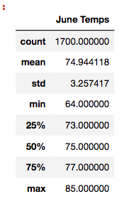
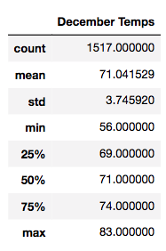
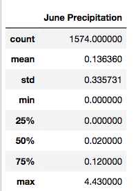
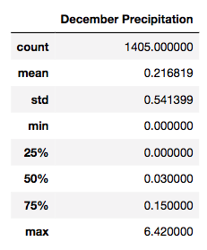
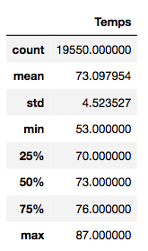

# Report on Weather Data Analysis in Oahu
Weather Data Analysis using SQLite, SQLAlchemy, Flask, and Python-Module 9

## Overview
This report is on the anaylsis of weather data of Oahu regarding an investment in an "Ice Cream and Surf" shop. The report investigates the precipitation and temperature trends and aims to provide answers if the investment is profitable. The analysis involves the years between 2010 and 2017. 

## Results
* Below are the tables showing the descriptive statistics of temperature in the month of June and December.

   

* The results indicate that the average temperature in June is only 3 degrees higher than the temperature in December.
* The difference in the maximum temperature observed is not very different (85 in June compared to 83 in December), 
* However, there is 10 degrees difference between the minimum temperature observed in these two months implying that it can get quite cold in December.
* The standard deviation in the temperature data is greater in December compared to June implying that there is more variation in the tempareature in December. 
* In order to gain more insights, additional queries were run on precipitation levels for June and December, and also on the overall temperature level between the years 2010 and 2017.

     

* The tables above show that the average precipitation level in December is almost twice as much as the average precipitation level in June.
* The standard deviation of precipitation levels in December is also greater than June.
* We can see that the average temperature in June is above the average temperature level throughout the year.
* The average temperature in December on the other hand, is lower than the average temperature level throughout the year.

## Summary

The results of the weather data analysis indicate that June is a better time of the year for ice cream and surf shop compared to December. In June, the weather is warmer, less precipitation is expected and there is less variability in the weather making it a more suitable time of the year for the investment. Lower average temperature, higher levels of precipitation, and higher standard deviation in both temperature and precipitation levels in December indicate that the weather is less predictable and hence it may not be an ideal time to open up an ice cream and surf shop during that time period.

